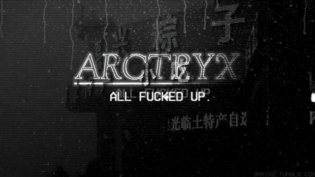
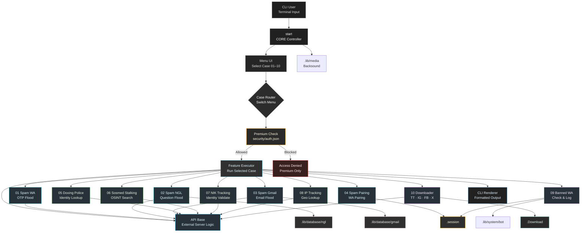
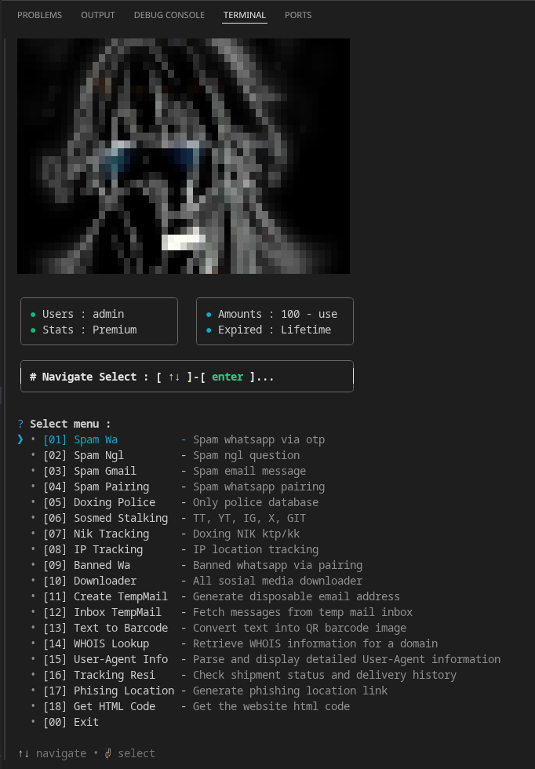
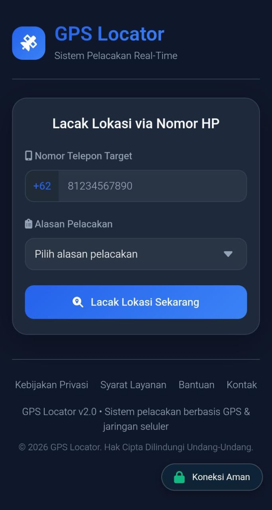

<!-- Wave Header -->
<p align="center">
  
</p>

<div align="center">



<br/>

<!-- Badges -->


<br/>


</div>

 ---

## 🧭 About Arctryx

> [!IMPORTANT]
> **`Arctryx`** is a ToolKit that combines various features such as spam and tracking **based on CLI Menu** with an easy and simple interactive display.

---

## ⚙️ Installation

<details open>

### 1. Update debian environment ( Linux / VPS / Termux)

```bash
apt update -y && apt upgrade -y && apt install git make -y
```

### 2. Clone the repository

```bash
git clone https://github.com/dcodemaxz/arctryx
```

### 3. Enter the project directory

```bash
cd arctryx
```
 
### 4. Install the dependencies (first time)

```bash
make install
```

### 5. Run script

```bash
make run
```

</details>

> [!IMPORTANT]
> `Select register` and copy the generated key and send it to [developer](https://t.me/dcodemaxz) for activation, or you can also select **Free Trial** to get an access token

---

## 🏗️ Architecture Overview



## 💡 Features



> [!TIP]
> This script uses a CLI Menu based interactive display that uses `(↑↓) & (enter)` **navigation** to make it easier to use.

### # List Menu

<details open>

- **[01] Spam Wa** :<br>
  Send repeated OTP requests to a target WhatsApp number.

- **[02] Spam Ngl** :<br>
  Send massive anonymous questions to a target NGL account.

- **[03] Spam Gmail** :<br>
  Send large volumes of emails to a target Gmail inbox.

- **[04] Spam Pairing** :<br>
  Send WhatsApp pairing codes repeatedly to a target phone number.

- **[05] Doxing Police** :<br>
  Search and retrieve personal data from police-related databases.

- **[06] Sosmed Stalking** :<br>
  Collect public data from social media platforms such as TikTok, Instagram, X (Twitter), YouTube, and GitHub.

- **[07] Nik Tracking** :<br>
  Track and retrieve information linked to Indonesian NIK (KTP/KK).

- **[08] IP Tracking** :<br>
  Identify approximate location and network details from an IP address.

- **[09] Banned Wa** :<br>
  Attempt to trigger WhatsApp account bans using pairing-based methods.

- **[10] Downloader** :<br>
  Download videos/audio from almost all social media platforms.

- **[11] Create TempMail** :<br>
  Generate a disposable email address instantly.

- **[12] Inbox TempMail** :<br>
  Fetch and read messages from a temporary email inbox.

- **[13] Text to Barcode** :<br>
  Convert any text into a QR code barcode image.

- **[14] WHOIS Lookup** :<br>
  Retrieve domain registration and ownership information.

- **[15] User-Agent Info** :<br>
  Parse and display detailed technical information from a User-Agent string.

- **[16] Tracking Resi** :<br>
  Check shipment status and delivery history of various couriers.

- **[17] Phising Location** :<br>
  Generate a phishing link that mimics a location‑sharing page.

  

- **[18] Get HTML Code** :<br>
  Get HTML Code from website link

- **[0] Exit** :<br>
  Exit the program.

</details>

### # Features

<details open>

- Login system
- Captcha system
- Register system
- Free trial system
- Auto login system
- Auto update system
- Auto play backsound

</details>

### # Benefits

<details open>

- Auto login
- No captcha
- Free updates
- Unlimited use
- Unlock all features
- Key reset guarantee
- Priority support

</details>

---

## 🤝 Feedback & Issues

> [!IMPORTANT]
> 
> **✅ You can:**
> - Report bugs by opening an issue
> - Suggest features via issues
> - Request documentation improvements
> 
> **❌ You cannot:**
> - Submit code changes (proprietary codebase)
> - Access source code for modification
> 
> **Support:** Available for licensed users via [Telegram](https://t.me/dcodemaxz)

---

## 🪪 License

> [!WARNING]
> 🔒 **Proprietary Software License** - [View full terms](LICENSE.md)

<!-- Wave Footer Divider -->


<div align="center">

<p><strong>🌐 Community</strong></p>

<table width="100%" cellspacing="0" cellpadding="10">
<tr>
<td align="center" valign="top">

<!-- Item 1: Group -->
<div style="margin-bottom: 40px; padding: 20px; max-width: 300px;">
  <div style="width: 50px; height: 2px; background: linear-gradient(90deg, transparent, #333, transparent); margin: 10px auto;"></div>
  <br><strong>WhatsApp Group</strong>
  <p style="margin: 10px 0;">Ask questions, share ideas & help</p>
  <div style="width: 50px; height: 2px; background: linear-gradient(90deg, transparent, #333, transparent); margin: 10px auto;"></div>
  <a href="https://chat.whatsapp.com/GlNdk54lm9V7C4U54SXnh1" style="text-decoration: none;">
    
  </a>
</div>

  ---

<!-- Item 2: Channel -->
<div style="margin-bottom: 40px; padding: 20px; max-width: 300px;">
  <div style="width: 50px; height: 2px; background: linear-gradient(90deg, transparent, #333, transparent); margin: 10px auto;"></div>
  <br><strong>WhatsApp Channel</strong>
  <p style="margin: 10px 0;">Official updates & announcements</p>
  <div style="width: 50px; height: 2px; background: linear-gradient(90deg, transparent, #333, transparent); margin: 10px auto;"></div>
  <a href="https://whatsapp.com/channel/0029VbBotdf1noz7cQLbTw45" style="text-decoration: none;">
    
  </a>
</div>

  ---

<!-- Item 3: Review -->
<div style="padding: 20px; max-width: 300px;">
  <div style="width: 50px; height: 2px; background: linear-gradient(90deg, transparent, #333, transparent); margin: 10px auto;"></div>
  <br><strong>Review Tool</strong>
  <p style="margin: 10px 0;">Watch tutorials & feature reviews</p>
  <div style="width: 50px; height: 2px; background: linear-gradient(90deg, transparent, #333, transparent); margin: 10px auto;"></div>
  <a href="https://youtu.be/xtTc9DaPi3k?si=s_stUbn5dghmt7rI" style="text-decoration: none;">
    
  </a>
</div>
  
</td>
</tr>
</table>

</div>

<!-- Wave Footer Divider -->


<div align="center">

  <!-- Repobeats Analytics -->
  <p><strong>📊 RepoBeats Analytics</strong></p>
  

---

  <!-- Star History -->
  <p><strong>🌟 Star History</strong></p>
  <a href="https://star-history.com/#dcodemaxz/arctryx&Date">
    
  </a>

  <hr/>

  <p><strong>Copyright | <a href="https://github.com/dcodemaxz">© 2025 - 2026 dcodemaxz</a></strong></p>

<!-- Wave Footer -->
<p align="center">
  
</p>

</div>
